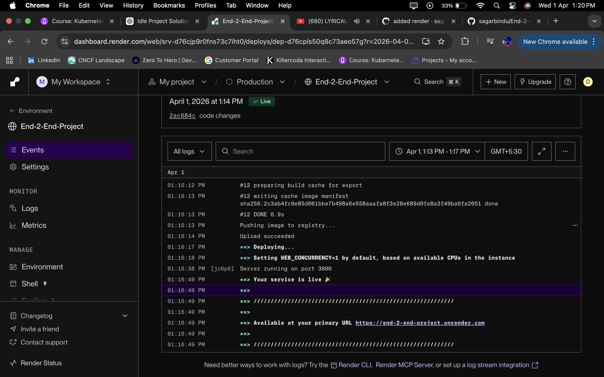
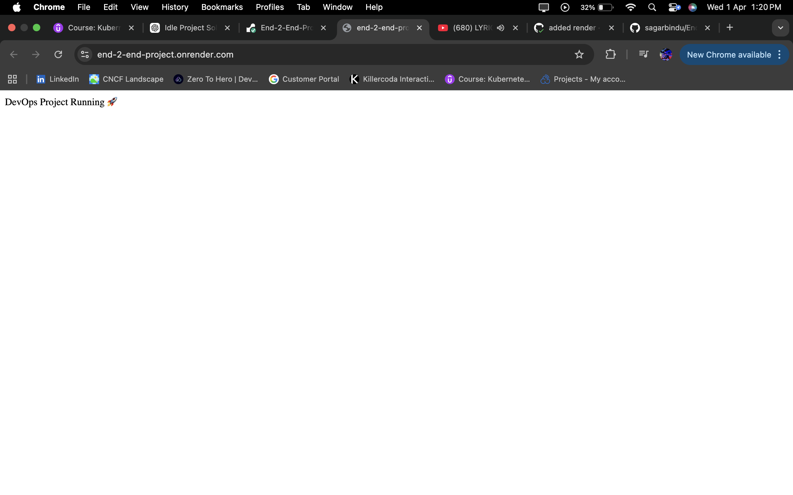

End-to-End DevOps Project (CI/CD + GitOps + Monitoring)
Overview

This project demonstrates a complete DevOps workflow:

Application built using Node.js

Docker image build and push using GitHub Actions

GitOps-based deployment using ArgoCD

Kubernetes deployment using Helm

Monitoring using Prometheus and Grafana

Architecture

Application → Docker → GitHub Actions → Docker Hub → GitOps Repo → ArgoCD → Kubernetes → Prometheus → Grafana

Tech Stack

Node.js (Application)

Docker (Containerization)

GitHub Actions (CI/CD)

Docker Hub (Image Registry)

Kubernetes (Minikube)

Helm (Packaging)

ArgoCD (GitOps Deployment)

Prometheus (Metrics Collection)

Grafana (Visualization)

Application Setup

Clone the repository

Install dependencies
npm install

Run locally
node app.js

Application runs on port 3000

Docker Setup

Build image
docker build -t <docker-username>/devops-app:tag .

Run container
docker run -p 3000:3000 <docker-username>/devops-app:tag

CI/CD Pipeline (GitHub Actions)

Pipeline stages:

Build Docker image

Push image to Docker Hub

Update image tag in GitOps repo

ArgoCD automatically deploys

Branch-based behavior:

dev branch updates values-dev.yaml

main branch updates values-prod.yaml

GitOps Repository

Separate repo used for deployment configuration.

Contains:

Helm chart

values-dev.yaml

values-prod.yaml

GitHub Actions updates image tag here.

ArgoCD watches this repo and syncs automatically.

Kubernetes Deployment

Helm is used to deploy application.

Key components:

Deployment

Service

ServiceMonitor (for Prometheus)

ArgoCD Setup

Install ArgoCD:

kubectl create namespace argocd
kubectl apply -n argocd -f https://raw.githubusercontent.com/argoproj/argo-cd/stable/manifests/install.yaml

Access UI:

kubectl port-forward svc/argocd-server -n argocd 8081:443

Open:

https://localhost:8081

Login using admin credentials.

Monitoring Setup

Install Prometheus and Grafana:

helm repo add prometheus-community https://prometheus-community.github.io/helm-charts

helm repo update
helm install monitoring prometheus-community/kube-prometheus-stack

Access Grafana

kubectl port-forward svc/monitoring-grafana 3000:80

Open:

http://localhost:3000

Application Metrics

Prometheus metrics added using prom-client.

Endpoint:

/metrics

Example metric:

http_requests_total

ServiceMonitor

Used to expose application metrics to Prometheus.

Ensures Prometheus scrapes /metrics endpoint.

Grafana Dashboard

Custom dashboard created with:

Total requests

Requests per second

Memory usage

CPU usage

Example queries:

http_requests_total
rate(http_requests_total[1m])
increase(http_requests_total[1m])

Troubleshooting

ImagePullBackOff
Check image name and Docker Hub access
Ensure image is public or use imagePullSecrets

Port-forward not working
Check correct port mapping
Ensure service port matches container port

Prometheus not showing metrics
Check ServiceMonitor labels match service labels
Verify /metrics endpoint is working

Grafana showing no data
Check time range
Use correct PromQL query
Generate traffic to application

Git push failed
Increase git buffer
git config --global http.postBuffer 524288000

Minikube not starting
Start Docker Desktop
Then run minikube start

What was implemented

CI/CD pipeline using GitHub Actions

GitOps deployment using ArgoCD

Helm-based Kubernetes deployment

Branch-based environment handling (dev and prod)

Application monitoring using Prometheus

Visualization using Grafana

Custom metrics integration

Future Enhancements

Add alerts using Alertmanager

Integrate Slack or email notifications

Add response time metrics

Add ingress for external access

Deploy on managed Kubernetes (AKS/EKS/GKE)
  

  

## Application Deployment (Render)

This application is deployed on Render using a Docker-based setup.

The service is publicly accessible via a live URL and automatically deploys on updates triggered from the CI/CD pipeline.

### Live Application

Live URL: https://your-app.onrender.com

### Deployment Setup

* Platform: Render
* Deployment Type: Docker
* Branch: main
* Region: Singapore
* Instance Type: Free tier

### How Deployment Works

1. Code is pushed to the repository
2. GitHub Actions pipeline builds the Docker image
3. Image is pushed to Docker Hub
4. Pipeline triggers Render deployment using Deploy Hook
5. Render pulls latest changes and redeploys the application

### Render Deploy Hook Integration

The pipeline triggers deployment using a secure webhook stored as a GitHub secret.

Secret used:
RENDER_DEPLOY_HOOK

Pipeline step:

curl -X POST ${{ secrets.RENDER_DEPLOY_HOOK }}

### Important Configuration

The application uses dynamic port configuration required by Render:

const PORT = process.env.PORT || 3000;

This ensures compatibility with Render’s runtime environment.

### Notes

* The service runs on the free tier and may sleep after inactivity
* Initial request after inactivity may take a few seconds (cold start)
* No manual intervention is required for deployment once pipeline is configured

### Benefits

* Fully automated deployment
* Publicly accessible application
* CI/CD integrated with cloud hosting
* Real-world deployment setup

---

# 👨‍💻 Author

Sagar Bindu Dash
DevOps Engineer

---
